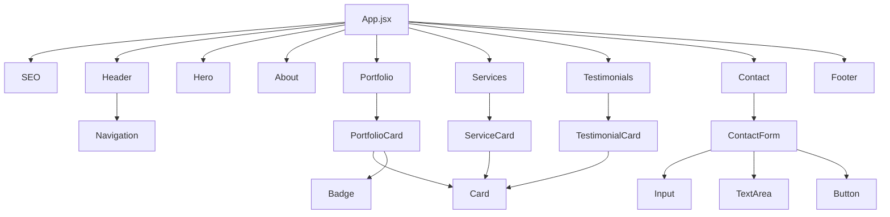

# J&H Digital Website - System Architecture Document

**Version:** 1.0.0  
**Last Updated:** 2025-10-24  
**Status:** Architecture Design Phase

---

## Table of Contents

1. [Executive Summary](#executive-summary)
2. [Technical Stack](#technical-stack)
3. [Project Structure](#project-structure)
4. [Component Architecture](#component-architecture)
5. [Design System Specification](#design-system-specification)
6. [Performance Strategy](#performance-strategy)
7. [SEO & Metadata Plan](#seo--metadata-plan)
8. [Deployment & Hosting](#deployment--hosting)
9. [Development Workflow](#development-workflow)
10. [Implementation Roadmap](#implementation-roadmap)

---

## Executive Summary

### Project Overview
J&H Digital's professional website is a single-page application (SPA) designed to showcase the agency's expertise in web development. The site emphasizes visual excellence, smooth interactions, and optimal performance, drawing inspiration from industry leaders like Apple, Notion, Linear, and Stripe.

### Core Objectives
- **Visual Excellence**: Apple-level design quality with smooth animations
- **Performance First**: Sub-3s load time, 90+ Lighthouse scores
- **Mobile-First**: Responsive design optimized for all devices
- **SEO Optimized**: Fast indexing, rich metadata, structured data
- **Maintainable**: Clean architecture, reusable components

### Key Features
- 7 core sections with smooth scroll navigation
- Interactive portfolio showcase
- Animated testimonials carousel
- Contact form with validation
- Responsive design across all breakpoints

---

## Technical Stack

### Core Framework
```
React 18.2+ with Vite 5+
├── Faster build times than Create React App
├── Hot Module Replacement (HMR)
├── Optimized production builds
└── Modern ES modules support
```

**Rationale**: Vite provides superior developer experience with instant server start, lightning-fast HMR, and optimized production builds. React 18 enables concurrent features and improved performance.

### Styling & UI
```
Tailwind CSS 3.4+
├── Utility-first approach
├── JIT (Just-In-Time) compilation
├── Custom design system integration
└── Minimal CSS bundle size
```

**Rationale**: Tailwind's utility-first approach enables rapid development while maintaining consistency. JIT mode ensures only used styles are included in the final bundle.

### Animation Library
```
Framer Motion 11+
├── Production-grade animations
├── Gesture support
├── Layout animations
├── Scroll-triggered animations
└── Performance optimized
```

**Rationale**: Framer Motion provides declarative animations with excellent performance. Built-in scroll animations and gesture support reduce custom code.

### Additional Libraries

| Library | Version | Purpose |
|---------|---------|---------|
| **Lucide React** | 0.400+ | Modern, tree-shakeable icons |
| **React Hook Form** | 7.50+ | Performant form handling |
| **React Helmet Async** | 2.0+ | SEO meta tags management |
| **React Intersection Observer** | 9.10+ | Scroll-triggered animations |
| **Zod** | 3.22+ | Form validation schemas |

---

## Project Structure

### Folder Hierarchy

```
jh-digital-website/
├── public/
│   ├── favicon.ico
│   ├── logo.svg
│   ├── og-image.jpg
│   └── robots.txt
│
├── src/
│   ├── assets/
│   │   ├── images/
│   │   │   ├── hero/
│   │   │   ├── portfolio/
│   │   │   └── team/
│   │   └── videos/
│   │
│   ├── components/
│   │   ├── layout/
│   │   │   ├── Header.jsx
│   │   │   ├── Footer.jsx
│   │   │   └── Navigation.jsx
│   │   │
│   │   ├── sections/
│   │   │   ├── Hero.jsx
│   │   │   ├── About.jsx
│   │   │   ├── Portfolio.jsx
│   │   │   ├── Services.jsx
│   │   │   ├── Testimonials.jsx
│   │   │   └── Contact.jsx
│   │   │
│   │   ├── ui/
│   │   │   ├── Button.jsx
│   │   │   ├── Card.jsx
│   │   │   ├── Input.jsx
│   │   │   ├── TextArea.jsx
│   │   │   ├── Badge.jsx
│   │   │   └── AnimatedText.jsx
│   │   │
│   │   └── features/
│   │       ├── PortfolioCard.jsx
│   │       ├── TestimonialCard.jsx
│   │       ├── ServiceCard.jsx
│   │       └── ContactForm.jsx
│   │
│   ├── hooks/
│   │   ├── useScrollProgress.js
│   │   ├── useInView.js
│   │   ├── useMediaQuery.js
│   │   └── useScrollTo.js
│   │
│   ├── data/
│   │   ├── portfolio.js
│   │   ├── services.js
│   │   ├── testimonials.js
│   │   └── siteConfig.js
│   │
│   ├── styles/
│   │   ├── index.css
│   │   └── animations.css
│   │
│   ├── utils/
│   │   ├── constants.js
│   │   ├── helpers.js
│   │   └── validators.js
│   │
│   ├── App.jsx
│   ├── main.jsx
│   └── SEO.jsx
│
├── .env.example
├── .eslintrc.cjs
├── .gitignore
├── .prettierrc
├── index.html
├── package.json
├── postcss.config.js
├── tailwind.config.js
├── vite.config.js
└── README.md
```

### Directory Responsibilities

#### `/public`
Static assets served directly without processing. Includes favicon, robots.txt, and social media images.

#### `/src/assets`
Media files (images, videos) organized by section. These are processed by Vite for optimization.

#### `/src/components`
All React components organized by type:
- **layout/**: Persistent UI elements (header, footer, navigation)
- **sections/**: Main page sections (hero, about, portfolio, etc.)
- **ui/**: Reusable UI primitives (buttons, inputs, cards)
- **features/**: Complex, feature-specific components

#### `/src/hooks`
Custom React hooks for shared logic (scroll detection, viewport queries, etc.)

#### `/src/data`
Static content and configuration. Easily editable for content updates without touching components.

#### `/src/styles`
Global styles and custom CSS animations not covered by Tailwind.

#### `/src/utils`
Helper functions, constants, and validation utilities.

---

## Component Architecture

### Component Hierarchy



### Core Components Specification

#### 1. Layout Components

##### **Header.jsx**
```javascript
// Responsibilities:
// - Fixed/sticky navigation bar
// - Logo and brand identity
// - Navigation menu (desktop/mobile)
// - Scroll-based styling changes

// Props: None (uses global state/context if needed)
// State: isScrolled, isMobileMenuOpen
// Animations: Fade in on mount, background blur on scroll
```

##### **Navigation.jsx**
```javascript
// Responsibilities:
// - Smooth scroll to sections
// - Active section highlighting
// - Mobile hamburger menu
// - Accessibility (keyboard navigation)

// Props: sections (array of {id, label})
// State: activeSection
// Hooks: useScrollProgress, useMediaQuery
```

##### **Footer.jsx**
```javascript
// Responsibilities:
// - Company information
// - Social media links
// - Copyright notice
// - Quick links

// Props: None
// State: None (static content)
```

#### 2. Section Components

##### **Hero.jsx**
```javascript
// Responsibilities:
// - Eye-catching headline and tagline
// - Call-to-action buttons
// - Background animation/gradient
// - Scroll indicator

// Props: None (uses data/siteConfig.js)
// Animations: 
//   - Text fade-in with stagger
//   - Button scale on hover
//   - Parallax background effect
```

##### **About.jsx**
```javascript
// Responsibilities:
// - Company story and mission
// - Team introduction
// - Core values/principles
// - Statistics/achievements

// Props: None
// Animations: Fade in on scroll, counter animations for stats
```

##### **Portfolio.jsx**
```javascript
// Responsibilities:
// - Project showcase grid
// - Filter by category (optional)
// - Project cards with hover effects
// - Modal/detail view (optional)

// Props: None (uses data/portfolio.js)
// Children: PortfolioCard components
// State: selectedCategory, projects
// Animations: Stagger grid items, hover scale
```

##### **Services.jsx**
```javascript
// Responsibilities:
// - Service offerings display
// - Icon + title + description cards
// - Grid/carousel layout

// Props: None (uses data/services.js)
// Children: ServiceCard components
// Animations: Fade in on scroll, hover lift effect
```

##### **Testimonials.jsx**
```javascript
// Responsibilities:
// - Client testimonials carousel
// - Auto-play with manual controls
// - Client photo, quote, name, company

// Props: None (uses data/testimonials.js)
// Children: TestimonialCard components
// State: currentIndex, isAutoPlaying
// Animations: Slide transitions, fade effects
```

##### **Contact.jsx**
```javascript
// Responsibilities:
// - Contact form
// - Form validation
// - Success/error messaging
// - Contact information display

// Props: None
// Children: ContactForm component
// State: Managed by ContactForm
```

#### 3. UI Components (Reusable Primitives)

##### **Button.jsx**
```javascript
// Props:
// - variant: 'primary' | 'secondary' | 'outline' | 'ghost'
// - size: 'sm' | 'md' | 'lg'
// - children: React.ReactNode
// - onClick: function
// - disabled: boolean
// - className: string (for overrides)

// Variants:
// - primary: Solid background, white text
// - secondary: Subtle background, colored text
// - outline: Border only, transparent background
// - ghost: No background, hover effect only
```

##### **Card.jsx**
```javascript
// Props:
// - children: React.ReactNode
// - className: string
// - hover: boolean (enable hover effects)
// - padding: 'sm' | 'md' | 'lg'

// Features:
// - Consistent border radius
// - Shadow on hover (if enabled)
// - Smooth transitions
```

##### **Input.jsx**
```javascript
// Props:
// - type: string
// - name: string
// - label: string
// - placeholder: string
// - error: string (validation error)
// - register: function (from react-hook-form)
// - required: boolean

// Features:
// - Floating label animation
// - Error state styling
// - Focus ring
```

##### **TextArea.jsx**
```javascript
// Props: Similar to Input
// - rows: number
// - Additional: auto-resize functionality
```

##### **Badge.jsx**
```javascript
// Props:
// - children: string
// - variant: 'default' | 'success' | 'warning' | 'error'
// - size: 'sm' | 'md'

// Use cases: Technology tags, status indicators
```

##### **AnimatedText.jsx**
```javascript
// Props:
// - text: string
// - variant: 'fade' | 'slide' | 'typewriter'
// - delay: number
// - duration: number

// Features: Reusable text animation wrapper
```

#### 4. Feature Components

##### **PortfolioCard.jsx**
```javascript
// Props:
// - project: {
//     id: string,
//     title: string,
//     description: string,
//     image: string,
//     tags: string[],
//     link: string
//   }

// Features:
// - Image with overlay on hover
// - Technology badges
// - View project button
// - Smooth transitions
```

##### **ServiceCard.jsx**
```javascript
// Props:
// - service: {
//     icon: React.Component,
//     title: string,
//     description: string
//   }

// Features:
// - Icon animation on hover
// - Consistent card styling
// - Responsive layout
```

##### **TestimonialCard.jsx**
```javascript
// Props:
// - testimonial: {
//     id: string,
//     quote: string,
//     author: string,
//     role: string,
//     company: string,
//     avatar: string
//   }

// Features:
// - Quote styling
// - Avatar image
// - Company logo (optional)
```

##### **ContactForm.jsx**
```javascript
// Props: None (self-contained)

// State:
// - formData: {name, email, message}
// - isSubmitting: boolean
// - submitStatus: 'idle' | 'success' | 'error'

// Features:
// - React Hook Form integration
// - Zod validation
// - Email service integration (Formspree/EmailJS)
// - Success/error notifications
// - Loading state during submission
```

### Data Flow Strategy

#### Static Content Management
```javascript
// src/data/portfolio.js
export const portfolioProjects = [
  {
    id: 'project-1',
    title: 'E-Commerce Platform',
    description: 'Modern shopping experience with React & Node.js',
    image: '/assets/images/portfolio/project-1.jpg',
    tags: ['React', 'Node.js', 'MongoDB'],
    link: 'https://example.com',
    featured: true
  },
  // ... more projects
];

// src/data/services.js
export const services = [
  {
    id: 'web-dev',
    icon: Code,
    title: 'Web Development',
    description: 'Custom websites built with modern technologies'
  },
  // ... more services
];

// src/data/testimonials.js
export const testimonials = [
  {
    id: 'testimonial-1',
    quote: 'J&H Digital transformed our online presence...',
    author: 'John Smith',
    role: 'CEO',
    company: 'Tech Corp',
    avatar: '/assets/images/testimonials/john-smith.jpg'
  },
  // ... more testimonials
];

// src/data/siteConfig.js
export const siteConfig = {
  name: 'J&H Digital',
  tagline: 'Crafting Digital Excellence',
  description: 'Professional web development agency...',
  url: 'https://jhdigital.com',
  email: 'hello@jhdigital.com',
  social: {
    twitter: 'https://twitter.com/jhdigital',
    linkedin: 'https://linkedin.com/company/jhdigital',
    github: 'https://github.com/jhdigital'
  }
};
```

#### State Management
**Approach**: Local component state with React hooks (no global state management needed)

**Rationale**: 
- Single-page application with minimal shared state
- Most data is static content
- Form state managed by React Hook Form
- Scroll position managed by custom hooks

**If scaling is needed later**: Consider Zustand (lightweight) or Context API for:
- Theme switching (dark/light mode)
- User preferences
- Multi-language support

### Custom Hooks

```javascript
// src/hooks/useScrollProgress.js
// Returns scroll progress (0-1) for animations
export const useScrollProgress = () => {
  const [progress, setProgress] = useState(0);
  // Implementation...
  return progress;
};

// src/hooks/useInView.js
// Detects when element enters viewport
export const useInView = (options) => {
  const [ref, inView] = useIntersectionObserver(options);
  return [ref, inView];
};

// src/hooks/useMediaQuery.js
// Responsive breakpoint detection
export const useMediaQuery = (query) => {
  const [matches, setMatches] = useState(false);
  // Implementation...
  return matches;
};

// src/hooks/useScrollTo.js
// Smooth scroll to section
export const useScrollTo = () => {
  const scrollTo = (elementId) => {
    // Implementation...
  };
  return scrollTo;
};
```

---

## Design System Specification

### Color Palette

#### Primary Colors
```css
/* Modern, professional blue palette */
--color-primary-50: #eff6ff;   /* Lightest - backgrounds */
--color-primary-100: #dbeafe;  /* Light - hover states */
--color-primary-200: #bfdbfe;  /* Light accent */
--color-primary-300: #93c5fd;  /* Medium light */
--color-primary-400: #60a5fa;  /* Medium */
--color-primary-500: #3b82f6;  /* Base - primary actions */
--color-primary-600: #2563eb;  /* Dark - hover on primary */
--color-primary-700: #1d4ed8;  /* Darker */
--color-primary-800: #1e40af;  /* Very dark */
--color-primary-900: #1e3a8a;  /* Darkest */
```

#### Accent Colors
```css
/* Complementary purple for highlights */
--color-accent-50: #faf5ff;
--color-accent-100: #f3e8ff;
--color-accent-200: #e9d5ff;
--color-accent-300: #d8b4fe;
--color-accent-400: #c084fc;
--color-accent-500: #a855f7;   /* Base accent */
--color-accent-600: #9333ea;
--color-accent-700: #7e22ce;
--color-accent-800: #6b21a8;
--color-accent-900: #581c87;
```

#### Neutral Colors
```css
/* Grayscale for text and backgrounds */
--color-neutral-50: #fafafa;   /* Lightest background */
--color-neutral-100: #f5f5f5;  /* Light background */
--color-neutral-200: #e5e5e5;  /* Borders */
--color-neutral-300: #d4d4d4;  /* Disabled states */
--color-neutral-400: #a3a3a3;  /* Placeholder text */
--color-neutral-500: #737373;  /* Secondary text */
--color-neutral-600: #525252;  /* Body text */
--color-neutral-700: #404040;  /* Headings */
--color-neutral-800: #262626;  /* Dark headings */
--color-neutral-900: #171717;  /* Darkest text */
```

#### Semantic Colors
```css
/* Status and feedback colors */
--color-success: #10b981;      /* Green - success states */
--color-warning: #f59e0b;      /* Amber - warnings */
--color-error: #ef4444;        /* Red - errors */
--color-info: #3b82f6;         /* Blue - information */
```

#### Background Colors
```css
--bg-primary: #ffffff;         /* Main background */
--bg-secondary: #fafafa;       /* Alternate sections */
--bg-tertiary: #f5f5f5;        /* Cards, elevated surfaces */
--bg-overlay: rgba(0, 0, 0, 0.5); /* Modal overlays */
```

### Typography Scale

#### Font Families
```css
/* Primary font stack - Modern sans-serif */
--font-primary: 'Inter', -apple-system, BlinkMacSystemFont, 'Segoe UI', 
                'Roboto', 'Oxygen', 'Ubuntu', 'Cantarell', sans-serif;

/* Monospace for code snippets (if needed) */
--font-mono: 'JetBrains Mono', 'Fira Code', 'Courier New', monospace;
```

#### Type Scale
```css
/* Fluid typography using clamp() for responsive scaling */

/* Display - Hero headlines */
--text-display: clamp(3rem, 8vw, 6rem);        /* 48px - 96px */
--line-height-display: 1.1;
--font-weight-display: 700;

/* Heading 1 - Section titles */
--text-h1: clamp(2.5rem, 5vw, 4rem);           /* 40px - 64px */
--line-height-h1: 1.2;
--font-weight-h1: 700;

/* Heading 2 - Subsection titles */
--text-h2: clamp(2rem, 4vw, 3rem);             /* 32px - 48px */
--line-height-h2: 1.3;
--font-weight-h2: 600;

/* Heading 3 - Card titles */
--text-h3: clamp(1.5rem, 3vw, 2rem);           /* 24px - 32px */
--line-height-h3: 1.4;
--font-weight-h3: 600;

/* Heading 4 - Small headings */
--text-h4: clamp(1.25rem, 2vw, 1.5rem);        /* 20px - 24px */
--line-height-h4: 1.5;
--font-weight-h4: 600;

/* Body Large - Lead paragraphs */
--text-body-lg: clamp(1.125rem, 1.5vw, 1.25rem); /* 18px - 20px */
--line-height-body-lg: 1.6;
--font-weight-body-lg: 400;

/* Body - Default text */
--text-body: 1rem;                             /* 16px */
--line-height-body: 1.6;
--font-weight-body: 400;

/* Body Small - Secondary text */
--text-body-sm: 0.875rem;                      /* 14px */
--line-height-body-sm: 1.5;
--font-weight-body-sm: 400;

/* Caption - Labels, metadata */
--text-caption: 0.75rem;                       /* 12px */
--line-height-caption: 1.4;
--font-weight-caption: 500;
```

#### Tailwind Configuration
```javascript
// tailwind.config.js
module.exports = {
  theme: {
    extend: {
      fontFamily: {
        sans: ['Inter', 'sans-serif'],
        mono: ['JetBrains Mono', 'monospace'],
      },
      fontSize: {
        'display': ['clamp(3rem, 8vw, 6rem)', { lineHeight: '1.1', fontWeight: '700' }],
        'h1': ['clamp(2.5rem, 5vw, 4rem)', { lineHeight: '1.2', fontWeight: '700' }],
        'h2': ['clamp(2rem, 4vw, 3rem)', { lineHeight: '1.3', fontWeight: '600' }],
        'h3': ['clamp(1.5rem, 3vw, 2rem)', { lineHeight: '1.4', fontWeight: '600' }],
        'h4': ['clamp(1.25rem, 2vw, 1.5rem)', { lineHeight: '1.5', fontWeight: '600' }],
        'body-lg': ['clamp(1.125rem, 1.5vw, 1.25rem)', { lineHeight: '1.6' }],
        'body': ['1rem', { lineHeight: '1.6' }],
        'body-sm': ['0.875rem', { lineHeight: '1.5' }],
        'caption': ['0.75rem', { lineHeight: '1.4', fontWeight: '500' }],
      },
    },
  },
};
```

### Spacing System

#### Base Unit: 4px (0.25rem)

```css
/* Spacing scale - Consistent rhythm */
--space-1: 0.25rem;    /* 4px */
--space-2: 0.5rem;     /* 8px */
--space-3: 0.75rem;    /* 12px */
--space-4: 1rem;       /* 16px */
--space-5: 1.25rem;    /* 20px */
--space-6: 1.5rem;     /* 24px */
--space-8: 2rem;       /* 32px */
--space-10: 2.5rem;    /* 40px */
--space-12: 3rem;      /* 48px */
--space-16: 4rem;      /* 64px */
--space-20: 5rem;      /* 80px */
--space-24: 6rem;      /* 96px */
--space-32: 8rem;      /* 128px */
```

#### Usage Guidelines
- **Component padding**: Use space-4 to space-8
- **Section padding**: Use space-16 to space-32
- **Element gaps**: Use space-2 to space-6
- **Margins between sections**: Use space-20 to space-32

### Border Radius

```css
--radius-sm: 0.25rem;   /* 4px - Small elements */
--radius-md: 0.5rem;    /* 8px - Buttons, inputs */
--radius-lg: 0.75rem;   /* 12px - Cards */
--radius-xl: 1rem;      /* 16px - Large cards */
--radius-2xl: 1.5rem;   /* 24px - Hero sections */
--radius-full: 9999px;  /* Circular - Avatars, badges */
```

### Shadows

```css
/* Elevation system - Subtle to prominent */
--shadow-sm: 0 1px 2px 0 rgba(0, 0, 0, 0.05);
--shadow-md: 0 4px 6px -1px rgba(0, 0, 0, 0.1), 
             0 2px 4px -1px rgba(0, 0, 0, 0.06);
--shadow-lg: 0 10px 15px -3px rgba(0, 0, 0, 0.1), 
             0 4px 6px -2px rgba(0, 0, 0, 0.05);
--shadow-xl: 0 20px 25px -5px rgba(0, 0, 0, 0.1), 
             0 10px 10px -5px rgba(0, 0, 0, 0.04);
--shadow-2xl: 0 25px 50px -12px rgba(0, 0, 0, 0.25);

/* Colored shadows for primary actions */
--shadow-primary: 0 10px 25px -5px rgba(59, 130, 246, 0.3);
--shadow-accent: 0 10px 25px -5px rgba(168, 85, 247, 0.3);
```

### Animation System

#### Timing Functions
```css
/* Easing curves - Natural motion */
--ease-in: cubic-bezier(0.4, 0, 1, 1);
--ease-out: cubic-bezier(0, 0, 0.2, 1);
--ease-in-out: cubic-bezier(0.4, 0, 0.2, 1);
--ease-bounce: cubic-bezier(0.68, -0.55, 0.265, 1.55);
--ease-smooth: cubic-bezier(0.25, 0.46, 0.45, 0.94);
```

#### Duration Scale
```css
--duration-fast: 150ms;      /* Quick interactions */
--duration-normal: 300ms;    /* Standard transitions */
--duration-slow: 500ms;      /* Emphasis animations */
--duration-slower: 700ms;    /* Page transitions */
```

#### Common Animations
```css
/* Fade in */
@keyframes fadeIn {
  from { opacity: 0; }
  to { opacity: 1; }
}

/* Slide up */
@keyframes slideUp {
  from {
    opacity: 0;
    transform: translateY(20px);
  }
  to {
    opacity: 1;
    transform: translateY(0);
  }
}

/* Scale in */
@keyframes scaleIn {
  from {
    opacity: 0;
    transform: scale(0.95);
  }
  to {
    opacity: 1;
    transform: scale(1);
  }
}

/* Pulse */
@keyframes pulse {
  0%, 100% { opacity: 1; }
  50% { opacity: 0.5; }
}
```

#### Framer Motion Variants
```javascript
// Reusable animation variants
export const fadeInUp = {
  hidden: { opacity: 0, y: 20 },
  visible: { 
    opacity: 1, 
    y: 0,
    transition: { duration: 0.5, ease: [0.25, 0.46, 0.45, 0.94] }
  }
};

export const staggerContainer = {
  hidden: { opacity: 0 },
  visible: {
    opacity: 1,
    transition: {
      staggerChildren: 0.1,
      delayChildren: 0.2
    }
  }
};

export const scaleOnHover = {
  rest: { scale: 1 },
  hover: { 
    scale: 1.05,
    transition: { duration: 0.3, ease: 'easeOut' }
  }
};
```

### Responsive Breakpoints

```javascript
// tailwind.config.js
module.exports = {
  theme: {
    screens: {
      'xs': '475px',    // Extra small devices
      'sm': '640px',    // Small devices (phones)
      'md': '768px',    // Medium devices (tablets)
      'lg': '1024px',   // Large devices (laptops)
      'xl': '1280px',   // Extra large devices (desktops)
      '2xl': '1536px',  // 2X large devices (large desktops)
    },
  },
};
```

#### Mobile-First Approach
```css
/* Base styles: Mobile (< 640px) */
.container {
  padding: 1rem;
}

/* Tablet and up */
@media (min-width: 768px) {
  .container {
    padding: 2rem;
  }
}

/* Desktop and up */
@media (min-width: 1024px) {
  .container {
    padding: 3rem;
  }
}
```

---

## Performance Strategy

### Performance Targets

| Metric | Target | Critical Threshold |
|--------|--------|-------------------|
| **First Contentful Paint (FCP)** | < 1.5s | < 2.0s |
| **Largest Contentful Paint (LCP)** | < 2.5s | < 3.0s |
| **Time to Interactive (TTI)** | < 3.0s | < 4.0s |
| **Cumulative Layout Shift (CLS)** | < 0.1 | < 0.25 |
| **First Input Delay (FID)** | < 100ms | < 300ms |
| **Lighthouse Score** | > 90 | > 80 |
| **Bundle Size (Initial)** | < 200KB | < 300KB |
| **Total Page Weight** | < 1MB | < 2MB |

### Code Splitting Strategy

#### Route-Based Splitting
```javascript
// App.jsx - Lazy load sections
import { lazy, Suspense } from 'react';

const Hero = lazy(() => import('./components/sections/Hero'));
const About = lazy(() => import('./components/sections/About'));
const Portfolio = lazy(() => import('./components/sections/Portfolio'));
const Services = lazy(() => import('./components/sections/Services'));
const Testimonials = lazy(() => import('./components/sections/Testimonials'));
const Contact = lazy(() => import('./components/sections/Contact'));

function App() {
  return (
    <Suspense fallback={<LoadingSpinner />}>
      <Hero />
      <About />
      <Portfolio />
      <Services />
      <Testimonials />
      <Contact />
    </Suspense>
  );
}
```

#### Component-Level Splitting
```javascript
// Heavy components loaded on demand
const VideoPlayer = lazy(() => import('./components/VideoPlayer'));
const AnimatedChart = lazy(() => import('./components/AnimatedChart'));
```

#### Vite Configuration
```javascript
// vite.config.js
export default defineConfig({
  build: {
    rollupOptions: {
      output: {
        manualChunks: {
          'vendor': ['react', 'react-dom'],
          'animations': ['framer-motion'],
          'forms': ['react-hook-form', 'zod'],
        }
      }
    },
    chunkSizeWarningLimit: 500,
  }
});
```

### Image Optimization

#### Strategy
1. **Format Selection**:
   - WebP for modern browsers (80% smaller than JPEG)
   - JPEG fallback for older browsers
   - SVG for logos and icons

2. **Responsive Images**:
```html
<picture>
  <source 
    srcset="image-320w.webp 320w,
            image-640w.webp 640w,
            image-1024w.webp 1024w"
    type="image/webp"
  />
  
</picture>
```

3. **Lazy Loading**:
   - Native lazy loading for images below the fold
   - Intersection Observer for custom loading logic
   - Blur-up placeholder technique

4. **Image Dimensions**:
   - Hero images: 1920x1080px (max)
   - Portfolio thumbnails: 800x600px
   - Team photos: 400x400px
   - Compress to 80-85% quality

#### Tools
- **vite-plugin-imagemin**: Automatic image optimization during build
- **sharp**: Server-side image processing (if needed)
- **Cloudinary/Imgix**: CDN with automatic optimization (optional)

### Font Optimization

```html
<!-- index.html - Preload critical fonts -->
<link rel="preconnect" href="https://fonts.googleapis.com">
<link rel="preconnect" href="https://fonts.gstatic.com" crossorigin>
<link 
  rel="preload" 
  href="https://fonts.googleapis.com/css2?family=Inter:wght@400;500;600;700&display=swap"
  as="style"
  onload="this.onload=null;this.rel='stylesheet'"
>

<!-- Fallback for no-JS -->
<noscript>
  <link 
    href="https://fonts.googleapis.com/css2?family=Inter:wght@400;500;600;700&display=swap"
    rel="stylesheet"
  >
</noscript>
```

**Best Practices**:
- Use `font-display: swap` to prevent invisible text
- Subset fonts to include only needed characters
- Self-host fonts for better control (optional)
- Limit to 2-3 font weights maximum

### Animation Performance

#### GPU Acceleration
```css
/* Use transform and opacity for smooth animations */
.animated-element {
  will-change: transform, opacity;
  transform: translateZ(0); /* Force GPU acceleration */
}

/* Avoid animating expensive properties */
/* ❌ Bad */
.bad-animation {
  transition: width 0.3s, height 0.3s, top 0.3s;
}

/* ✅ Good */
.good-animation {
  transition: transform 0.3s, opacity 0.3s;
}
```

#### Framer Motion Optimization
```javascript
// Use layout animations for smooth transitions
<motion.div layout layoutId="unique-id">
  {/* Content */}
</motion.div>

// Reduce motion for accessibility
const prefersReducedMotion = window.matchMedia(
  '(prefers-reduced-motion: reduce)'
).matches;

const variants = {
  hidden: { opacity: 0, y: prefersReducedMotion ? 0 : 20 },
  visible: { opacity: 1, y: 0 }
};
```

### Bundle Size Optimization

#### Tree Shaking
```javascript
// ✅ Import only what you need
import { motion } from 'framer-motion';
import { Mail, Phone } from 'lucide-react';

// ❌ Avoid importing entire libraries
import * as Icons from 'lucide-react'; // Bad
```

#### Dynamic Imports
```javascript
// Load heavy libraries only when needed
const handleChartView = async () => {
  const { Chart } = await import('chart.js');
  // Use Chart...
};
```

#### Dependency Audit
```bash
# Analyze bundle size
npm run build
npx vite-bundle-visualizer

# Check for duplicate dependencies
npx depcheck
```

### Caching Strategy

#### Service Worker (Optional)
```javascript
// vite-plugin-pwa configuration
import { VitePWA } from 'vite-plugin-pwa';

export default defineConfig({
  plugins: [
    VitePWA({
      registerType: 'autoUpdate',
      workbox: {
        globPatterns: ['**/*.{js,css,html,ico,png,svg,webp}'],
        runtimeCaching: [
          {
            urlPattern: /^https:\/\/fonts\.googleapis\.com\/.*/i,
            handler: 'CacheFirst',
            options: {
              cacheName: 'google-fonts-cache',
              expiration: {
                maxEntries: 10,
                maxAgeSeconds: 60 * 60 * 24 * 365 // 1 year
              }
            }
          }
        ]
      }
    })
  ]
});
```

#### HTTP Caching Headers
```
# .htaccess or server configuration
<IfModule mod_expires.c>
  ExpiresActive On
  ExpiresByType image/webp "access plus 1 year"
  ExpiresByType image/jpeg "access plus 1 year"
  ExpiresByType image/png "access plus 1 year"
  ExpiresByType text/css "access plus 1 month"
  ExpiresByType application/javascript "access plus 1 month"
</IfModule>
```

### Performance Monitoring

#### Tools
- **Lighthouse CI**: Automated performance testing
- **Web Vitals**: Real user monitoring
- **Bundle Analyzer**: Visualize bundle composition

#### Implementation
```javascript
// src/utils/analytics.js
import { getCLS, getFID, getFCP, getLCP, getTTFB } from 'web-vitals';

function sendToAnalytics(metric) {
  // Send to analytics service
  console.log(metric);
}

getCLS(sendToAnalytics);
getFID(sendToAnalytics);
getFCP(sendToAnalytics);
getLCP(sendToAnalytics);
getTTFB(sendToAnalytics);
```

---

## SEO & Metadata Plan

### Meta Tags Structure

#### Base Configuration
```javascript
// src/SEO.jsx
import { Helmet } from 'react-helmet-async';
import { siteConfig } from './data/siteConfig';

export default function SEO({ 
  title, 
  description, 
  image, 
  url,
  type = 'website' 
}) {
  const siteTitle = title 
    ? `${title} | ${siteConfig.name}` 
    : `${siteConfig.name} - ${siteConfig.tagline}`;
  
  const siteDescription = description || siteConfig.description;
  const siteImage = image || `${siteConfig.url}/og-image.jpg`;
  const siteUrl = url || siteConfig.url;

  return (
    <Helmet>
      {/* Primary Meta Tags */}
      <title>{siteTitle}</title>
      <meta name="title" content={siteTitle} />
      <meta name="description" content={siteDescription} />
      <link rel="canonical" href={siteUrl} />

      {/* Open Graph / Facebook */}
      <meta property="og:type" content={type} />
      <meta property="og:url" content={siteUrl} />
      <meta property="og:title" content={siteTitle} />
      <meta property="og:description" content={siteDescription} />
      <meta property="og:image" content={siteImage} />
      <meta property="og:site_name" content={siteConfig.name} />

      {/* Twitter */}
      <meta property="twitter:card" content="summary_large_image" />
      <meta property="twitter:url" content={siteUrl} />
      <meta property="twitter:title" content={siteTitle} />
      <meta property="twitter:description" content={siteDescription} />
      <meta property="twitter:image" content={siteImage} />

      {/* Additional Meta Tags */}
      <meta name="robots" content="index, follow" />
      <meta name="language" content="English" />
      <meta name="author" content={siteConfig.name} />
    </Helmet>
  );
}
```

### Structured Data (JSON-LD)

#### Organization Schema
```javascript
// src/data/structuredData.js
export const organizationSchema = {
  "@context": "https://schema.org",
  "@type": "Organization",
  "name": "J&H Digital",
  "url": "https://jhdigital.com",
  "logo": "https://jhdigital.com/logo.svg",
  "description": "Professional web development agency specializing in modern, high-performance websites",
  "address": {
    "@type": "PostalAddress",
    "addressCountry": "US"
  },
  "contactPoint": {
    "@type": "ContactPoint",
    "telephone": "+1-XXX-XXX-XXXX",
    "contactType": "Customer Service",
    "email": "hello@jhdigital.com"
  },
  "sameAs": [
    "https://twitter.com/jhdigital",
    "https://linkedin.com/company/jhdigital",
    "https://github.com/jhdigital"
  ]
};
```

#### Website Schema
```javascript
export const websiteSchema = {
  "@context": "https://schema.org",
  "@type": "WebSite",
  "name": "J&H Digital",
  "url": "https://jhdigital.com",
  "potentialAction": {
    "@type": "SearchAction",
    "target": "https://jhdigital.com/search?q={search_term_string}",
    "query-input": "required name=search_term_string"
  }
};
```

#### Service Schema
```javascript
export const serviceSchema = {
  "@context": "https://schema.org",
  "@type": "Service",
  "serviceType": "Web Development",
  "provider": {
    "@type": "Organization",
    "name": "J&H Digital"
  },
  "areaServed": "Worldwide",
  "hasOfferCatalog": {
    "@type": "OfferCatalog",
    "name": "Web Development Services",
    "itemListElement": [
      {
        "@type": "Offer",
        "itemOffered": {
          "@type": "Service",
          "name": "Custom Web Development"
        }
      },
      {
        "@type": "Offer",
        "itemOffered": {
          "@type": "Service",
          "name": "E-Commerce Solutions"
        }
      }
    ]
  }
};
```

#### Implementation
```javascript
// App.jsx
import { organizationSchema, websiteSchema } from './data/structuredData';

function App() {
  return (
    <>
      <Helmet>
        <script type="application/ld+json">
          {JSON.stringify(organizationSchema)}
        </script>
        <script type="application/ld+json">
          {JSON.stringify(websiteSchema)}
        </script>
      </Helmet>
      {/* Rest of app */}
    </>
  );
}
```

### Sitemap & Robots.txt

#### robots.txt
```
# public/robots.txt
User-agent: *
Allow: /

Sitemap: https://jhdigital.com/sitemap.xml
```

#### Sitemap Generation
```xml
<!-- public/sitemap.xml -->
<?xml version="1.0" encoding="UTF-8"?>
<urlset xmlns="http://www.sitemaps.org/schemas/sitemap/0.9">
  <url>
    <loc>https://jhdigital.com/</loc>
    <lastmod>2025-10-24</lastmod>
    <changefreq>weekly</changefreq>
    <priority>1.0</priority>
  </url>
  <url>
    <loc>https://jhdigital.com/#about</loc>
    <lastmod>2025-10-24</lastmod>
    <changefreq>monthly</changefreq>
    <priority>0.8</priority>
  </url>
  <url>
    <loc>https://jhdigital.com/#portfolio</loc>
    <lastmod>2025-10-24</lastmod>
    <changefreq>weekly</changefreq>
    <priority>0.9</priority>
  </url>
  <!-- Additional URLs -->
</urlset>
```

### Accessibility (A11y)

#### ARIA Labels
```javascript
// Navigation with proper ARIA
<nav aria-label="Main navigation">
  <ul role="list">
    <li><a href="#about" aria-label="About section">About</a></li>
    <li><a href="#portfolio" aria-label="Portfolio section">Portfolio</a></li>
  </ul>
</nav>
```

#### Semantic HTML
```javascript
// Use semantic elements
<header>
  <nav>...</nav>
</header>

<main>
  <section aria-labelledby="about-heading">
    <h2 id="about-heading">About Us</h2>
  </section>
</main>

<footer>
  <address>...</address>
</footer>
```

#### Keyboard Navigation
```javascript
// Ensure all interactive elements are keyboard accessible
<button 
  onClick={handleClick}
  onKeyDown={(e) => e.key === 'Enter' && handleClick()}
  aria-label="Open menu"
>
  Menu
</button>
```

#### Focus Management
```css
/* Visible focus indicators */
:focus-visible {
  outline: 2px solid var(--color-primary-500);
  outline-offset: 2px;
}

/* Skip to main content link */
.skip-to-main {
  position: absolute;
  top: -40px;
  left: 0;
  background: var(--color-primary-500);
  color: white;
  padding: 8px;
  text-decoration: none;
  z-index: 100;
}

.skip-to-main:focus {
  top: 0;
}
```

---

## Deployment & Hosting

### Recommended Platforms

#### Option 1: Vercel (Recommended)
**Pros**:
- Zero-config deployment for Vite/React
- Automatic HTTPS and CDN
- Preview deployments for PRs
- Excellent performance
- Free tier generous for small sites

**Configuration**:
```json
// vercel.json
{
  "buildCommand": "npm run build",
  "outputDirectory": "dist",
  "devCommand": "npm run dev",
  "framework": "vite",
  "rewrites": [
    { "source": "/(.*)", "destination": "/index.html" }
  ],
  "headers": [
    {
      "source": "/assets/(.*)",
      "headers": [
        {
          "key": "Cache-Control",
          "value": "public, max-age=31536000, immutable"
        }
      ]
    }
  ]
}
```

#### Option 2: Netlify
**Pros**:
- Simple drag-and-drop deployment
- Built-in form handling (useful for contact form)
- Serverless functions support
- Free SSL certificates

**Configuration**:
```toml
# netlify.toml
[build]
  command = "npm run build"
  publish = "dist"

[[redirects]]
  from = "/*"
  to = "/index.html"
  status = 200

[[headers]]
  for = "/assets/*"
  [headers.values]
    Cache-Control = "public, max-age=31536000, immutable"
```

#### Option 3: GitHub Pages
**Pros**:
- Free hosting for public repos
- Simple GitHub Actions integration
- Good for portfolio sites

**Configuration**:
```yaml
# .github/workflows/deploy.yml
name: Deploy to GitHub Pages

on:
  push:
    branches: [ main ]

jobs:
  build-and-deploy:
    runs-on: ubuntu-latest
    steps:
      - uses: actions/checkout@v3
      
      - name: Setup Node.js
        uses: actions/setup-node@v3
        with:
          node-version: '18'
          
      - name: Install dependencies
        run: npm ci
        
      - name: Build
        run: npm run build
        
      - name: Deploy
        uses: peaceiris/actions-gh-pages@v3
        with:
          github_token: ${{ secrets.GITHUB_TOKEN }}
          publish_dir: ./dist
```

### Environment Variables

```bash
# .env.example
VITE_SITE_URL=https://jhdigital.com
VITE_CONTACT_EMAIL=hello@jhdigital.com
VITE_FORMSPREE_ID=your_formspree_id
VITE_GA_TRACKING_ID=G-XXXXXXXXXX
VITE_API_URL=https://api.jhdigital.com
```

**Security Note**: Never commit `.env` file. Use platform-specific environment variable management.

### CI/CD Pipeline

#### GitHub Actions Workflow
```yaml
# .github/workflows/ci.yml
name: CI

on:
  pull_request:
    branches: [ main, develop ]
  push:
    branches: [ main, develop ]

jobs:
  test:
    runs-on: ubuntu-latest
    
    steps:
      - uses: actions/checkout@v3
      
      - name: Setup Node.js
        uses: actions/setup-node@v3
        with:
          node-version: '18'
          cache: 'npm'
          
      - name: Install dependencies
        run: npm ci
        
      - name: Lint
        run: npm run lint
        
      - name: Build
        run: npm run build
        
      - name: Lighthouse CI
        run: |
          npm install -g @lhci/cli
          lhci autorun
```

### Domain Configuration

#### Custom Domain Setup
1. **Purchase domain** (Namecheap, Google Domains, etc.)
2. **Configure DNS**:
   ```
   Type: A
   Name: @
   Value: [Hosting provider IP]
   
   Type: CNAME
   Name: www
   Value: [Hosting provider domain]
   ```
3. **Enable HTTPS** (automatic on Vercel/Netlify)
4. **Set up redirects** (www → non-www or vice versa)

### Monitoring & Analytics

#### Google Analytics 4
```javascript
// src/utils/analytics.js
export const initGA = () => {
  const script = document.createElement('script');
  script.src = `https://www.googletagmanager.com/gtag/js?id=${import.meta.env.VITE_GA_TRACKING_ID}`;
  script.async = true;
  document.head.appendChild(script);

  window.dataLayer = window.dataLayer || [];
  function gtag() { dataLayer.push(arguments); }
  gtag('js', new Date());
  gtag('config', import.meta.env.VITE_GA_TRACKING_ID);
};

// Track custom events
export const trackEvent = (eventName, eventParams) => {
  if (window.gtag) {
    window.gtag('event', eventName, eventParams);
  }
};
```

#### Error Tracking (Optional)
```javascript
// Sentry integration
import * as Sentry from "@sentry/react";

Sentry.init({
  dsn: import.meta.env.VITE_SENTRY_DSN,
  environment: import.meta.env.MODE,
  tracesSampleRate: 1.0,
});
```

---

## Development Workflow

### Initial Setup

```bash
# 1. Create project
npm create vite@latest jh-digital-website -- --template react
cd jh-digital-website

# 2. Install dependencies
npm install

# 3. Install additional packages
npm install tailwindcss postcss autoprefixer
npm install framer-motion lucide-react
npm install react-hook-form zod @hookform/resolvers
npm install react-helmet-async
npm install react-intersection-observer

# 4. Install dev dependencies
npm install -D @tailwindcss/forms @tailwindcss/typography
npm install -D eslint prettier eslint-config-prettier
npm install -D vite-plugin-imagemin

# 5. Initialize Tailwind
npx tailwindcss init -p
```

### Project Configuration Files

#### package.json Scripts
```json
{
  "scripts": {
    "dev": "vite",
    "build": "vite build",
    "preview": "vite preview",
    "lint": "eslint . --ext js,jsx --report-unused-disable-directives --max-warnings 0",
    "format": "prettier --write \"src/**/*.{js,jsx,css,md}\"",
    "analyze": "vite-bundle-visualizer"
  }
}
```

#### ESLint Configuration
```javascript
// .eslintrc.cjs
module.exports = {
  root: true,
  env: { browser: true, es2020: true },
  extends: [
    'eslint:recommended',
    'plugin:react/recommended',
    'plugin:react/jsx-runtime',
    'plugin:react-hooks/recommended',
    'prettier'
  ],
  ignorePatterns: ['dist', '.eslintrc.cjs'],
  parserOptions: { ecmaVersion: 'latest', sourceType: 'module' },
  settings: { react: { version: '18.2' } },
  plugins: ['react-refresh'],
  rules: {
    'react-refresh/only-export-components': [
      'warn',
      { allowConstantExport: true },
    ],
    'react/prop-types': 'off',
  },
}
```

#### Prettier Configuration
```json
// .prettierrc
{
  "semi": true,
  "trailingComma": "es5",
  "singleQuote": true,
  "printWidth": 80,
  "tabWidth": 2,
  "useTabs": false
}
```

#### Tailwind Configuration
```javascript
// tailwind.config.js
/** @type {import('tailwindcss').Config} */
export default {
  content: [
    "./index.html",
    "./src/**/*.{js,ts,jsx,tsx}",
  ],
  theme: {
    extend: {
      colors: {
        primary: {
          50: '#eff6ff',
          100: '#dbeafe',
          200: '#bfdbfe',
          300: '#93c5fd',
          400: '#60a5fa',
          500: '#3b82f6',
          600: '#2563eb',
          700: '#1d4ed8',
          800: '#1e40af',
          900: '#1e3a8a',
        },
        accent: {
          50: '#faf5ff',
          100: '#f3e8ff',
          200: '#e9d5ff',
          300: '#d8b4fe',
          400: '#c084fc',
          500: '#a855f7',
          600: '#9333ea',
          700: '#7e22ce',
          800: '#6b21a8',
          900: '#581c87',
        },
      },
      fontFamily: {
        sans: ['Inter', 'sans-serif'],
      },
      fontSize: {
        'display': ['clamp(3rem, 8vw, 6rem)', { lineHeight: '1.1', fontWeight: '700' }],
        'h1': ['clamp(2.5rem, 5vw, 4rem)', { lineHeight: '1.2', fontWeight: '700' }],
        'h2': ['clamp(2rem, 4vw, 3rem)', { lineHeight: '1.3', fontWeight: '600' }],
        'h3': ['clamp(1.5rem, 3vw, 2rem)', { lineHeight: '1.4', fontWeight: '600' }],
      },
      animation: {
        'fade-in': 'fadeIn 0.5s ease-out',
        'slide-up': 'slideUp 0.5s ease-out',
        'scale-in': 'scaleIn 0.3s ease-out',
      },
      keyframes: {
        fadeIn: {
          '0%': { opacity: '0' },
          '100%': { opacity: '1' },
        },
        slideUp: {
          '0%': { opacity: '0', transform: 'translateY(20px)' },
          '100%': { opacity: '1', transform: 'translateY(0)' },
        },
        scaleIn: {
          '0%': { opacity: '0', transform: 'scale(0.95)' },
          '100%': { opacity: '1', transform: 'scale(1)' },
        },
      },
    },
  },
  plugins: [
    require('@tailwindcss/forms'),
    require('@tailwindcss/typography'),
  ],
}
```

#### Vite Configuration
```javascript
// vite.config.js
import { defineConfig } from 'vite'
import react from '@vitejs/plugin-react'
import path from 'path'

export default defineConfig({
  plugins: [react()],
  resolve: {
    alias: {
      '@': path.resolve(__dirname, './src'),
      '@components': path.resolve(__dirname, './src/components'),
      '@assets': path.resolve(__dirname, './src/assets'),
      '@hooks': path.resolve(__dirname, './src/hooks'),
      '@utils': path.resolve(__dirname, './src/utils'),
      '@data': path.resolve(__dirname, './src/data'),
    },
  },
  build: {
    rollupOptions: {
      output: {
        manualChunks: {
          'vendor': ['react', 'react-dom'],
          'animations': ['framer-motion'],
          'forms': ['react-hook-form', 'zod'],
        }
      }
    },
    chunkSizeWarningLimit: 500,
  },
  server: {
    port: 3000,
    open: true,
  },
})
```

### Git Workflow

#### Branch Strategy
```
main (production)
  └── develop (staging)
       ├── feature/hero-section
       ├── feature/portfolio-grid
       └── feature/contact-form
```

#### Commit Convention
```
feat: Add hero section with animations
fix: Resolve mobile menu toggle issue
style: Update button hover states
refactor: Simplify portfolio card component
docs: Update README with setup instructions
perf: Optimize image loading
test: Add form validation tests
```

### Development Checklist

#### Before Starting Development
- [ ] Review architecture document
- [ ] Set up development environment
- [ ] Install all dependencies
- [ ] Configure ESLint and Prettier
- [ ] Set up Git repository
- [ ] Create initial project structure

#### During Development
- [ ] Follow component architecture
- [ ] Use design system tokens
- [ ] Write semantic HTML
- [ ] Ensure accessibility
- [ ] Test on multiple devices
- [ ] Optimize images before adding
- [ ] Keep bundle size in check

#### Before Deployment
- [ ] Run production build
- [ ] Test all functionality
- [ ] Check Lighthouse scores
- [ ] Validate HTML/CSS
- [ ] Test on real devices
- [ ] Review SEO meta tags
- [ ] Set up analytics
- [ ] Configure environment variables

---

## Implementation Roadmap

### Phase 1: Foundation (Week 1)
**Goal**: Set up project infrastructure and core layout

#### Tasks:
1. **Project Setup** (Day 1)
   - Initialize Vite + React project
   - Install and configure dependencies
   - Set up Tailwind CSS
   - Configure ESLint and Prettier
   - Create folder structure

2. **Design System Implementation** (Day 2)
   - Configure Tailwind theme
   - Create CSS custom properties
   - Set up typography scale
   - Define color palette
   - Create animation utilities

3. **Core Layout Components** (Day 3-4)
   - Build Header component
   - Build Navigation component
   - Build Footer component
   - Implement smooth scroll
   - Add mobile menu

4. **UI Component Library** (Day 5)
   - Create Button component
   - Create Card component
   - Create Input component
   - Create TextArea component
   - Create Badge component

**Deliverables**:
- ✅ Fully configured development environment
- ✅ Complete design system
- ✅ Reusable UI components
- ✅ Responsive header and footer

---

### Phase 2: Core Sections (Week 2)
**Goal**: Build main content sections

#### Tasks:
1. **Hero Section** (Day 1-2)
   - Create Hero component
   - Add headline and tagline
   - Implement CTA buttons
   - Add background animations
   - Add scroll indicator

2. **About Section** (Day 2-3)
   - Create About component
   - Add company story
   - Add statistics/achievements
   - Implement scroll animations
   - Add team introduction

3. **Services Section** (Day 3-4)
   - Create Services component
   - Create ServiceCard component
   - Add service data
   - Implement grid layout
   - Add hover animations

4. **Testing & Refinement** (Day 5)
   - Test all sections
   - Fix responsive issues
   - Optimize animations
   - Review accessibility

**Deliverables**:
- ✅ Hero section with animations
- ✅ About section with content
- ✅ Services section with cards
- ✅ Mobile-responsive design

---

### Phase 3: Interactive Features (Week 3)
**Goal**: Add portfolio and testimonials

#### Tasks:
1. **Portfolio Section** (Day 1-3)
   - Create Portfolio component
   - Create PortfolioCard component
   - Add portfolio data
   - Implement grid layout
   - Add filter functionality (optional)
   - Add hover effects
   - Implement modal/detail view (optional)

2. **Testimonials Section** (Day 3-4)
   - Create Testimonials component
   - Create TestimonialCard component
   - Add testimonial data
   - Implement carousel
   - Add auto-play functionality
   - Add navigation controls

3. **Testing & Optimization** (Day 5)
   - Test interactions
   - Optimize animations
   - Check performance
   - Fix bugs

**Deliverables**:
- ✅ Portfolio showcase with filtering
- ✅ Testimonials carousel
- ✅ Smooth interactions
- ✅ Performance optimized

---

### Phase 4: Contact & Forms (Week 4)
**Goal**: Implement contact functionality

#### Tasks:
1. **Contact Section** (Day 1-2)
   - Create Contact component
   - Create ContactForm component
   - Add form fields
   - Implement validation
   - Add error handling

2. **Form Integration** (Day 2-3)
   - Set up Formspree/EmailJS
   - Implement form submission
   - Add success/error messages
   - Add loading states
   - Test email delivery

3. **Final Polish** (Day 4-5)
   - Review all sections
   - Fix any issues
   - Optimize performance
   - Test on devices
   - Prepare for deployment

**Deliverables**:
- ✅ Working contact form
- ✅ Email integration
- ✅ Form validation
- ✅ User feedback

---

### Phase 5: SEO & Deployment (Week 5)
**Goal**: Optimize and launch

#### Tasks:
1. **SEO Implementation** (Day 1-2)
   - Add meta tags
   - Implement structured data
   - Create sitemap
   - Add robots.txt
   - Optimize images
   - Test SEO scores

2. **Performance Optimization** (Day 2-3)
   - Analyze bundle size
   - Implement code splitting
   - Optimize images
   - Add lazy loading
   - Test Lighthouse scores
   - Fix performance issues

3. **Deployment Setup** (Day 3-4)
   - Choose hosting platform
   - Configure deployment
   - Set up custom domain
   - Configure SSL
   - Set up analytics
   - Test production build

4. **Launch & Monitoring** (Day 5)
   - Deploy to production
   - Test live site
   - Monitor analytics
   - Set up error tracking
   - Create documentation

**Deliverables**:
- ✅ SEO-optimized site
- ✅ High performance scores
- ✅ Live production site
- ✅ Analytics configured
- ✅ Documentation complete

---

## Success Metrics

### Technical Metrics
- ✅ Lighthouse Performance Score: > 90
- ✅ Lighthouse Accessibility Score: > 95
- ✅ Lighthouse Best Practices Score: > 90
- ✅ Lighthouse SEO Score: > 95
- ✅ Bundle Size: < 200KB (initial load)
- ✅ First Contentful Paint: < 1.5s
- ✅ Time to Interactive: < 3.0s

### User Experience Metrics
- ✅ Mobile-friendly (Google Mobile-Friendly Test)
- ✅ Cross-browser compatible (Chrome, Firefox, Safari, Edge)
- ✅ Smooth 60fps animations
- ✅ Accessible (WCAG 2.1 Level AA)
- ✅ Fast form submission (< 2s)

### Business Metrics
- ✅ Contact form conversion rate
- ✅ Average session duration
- ✅ Bounce rate
- ✅ Page views per session
- ✅ Mobile vs desktop traffic

---

## Maintenance & Updates

### Regular Tasks
- **Weekly**: Monitor analytics and performance
- **Monthly**: Update dependencies
- **Quarterly**: Review and update content
- **Annually**: Major design refresh (if needed)

### Content Updates
- Portfolio projects: Add new work regularly
- Testimonials: Collect and add client feedback
- Services: Update offerings as business evolves
- Blog (future): Add industry insights

### Technical Updates
- Keep dependencies up to date
- Monitor security vulnerabilities
- Update browser compatibility
- Optimize based on analytics

---

## Appendix

### Useful Resources

#### Documentation
- [React Documentation](https://react.dev)
- [Vite Documentation](https://vitejs.dev)
- [Tailwind CSS Documentation](https://tailwindcss.com)
- [Framer Motion Documentation](https://www.framer.com/motion)

#### Design Inspiration
- [Apple](https://www.apple.com)
- [Notion](https://www.notion.so)
- [Linear](https://linear.app)
- [Stripe](https://stripe.com)

#### Tools
- [Figma](https://www.figma.com) - Design mockups
- [Lighthouse](https://developers.google.com/web/tools/lighthouse) - Performance testing
- [WebPageTest](https://www.webpagetest.org) - Performance analysis
- [Can I Use](https://caniuse.com) - Browser compatibility

### Contact Form Options

#### Option 1: Formspree
```javascript
// Free tier: 50 submissions/month
const handleSubmit = async (data) => {
  const response = await fetch('https://formspree.io/f/YOUR_FORM_ID', {
    method: 'POST',
    headers: { 'Content-Type': 'application/json' },
    body: JSON.stringify(data)
  });
  return response.ok;
};
```

#### Option 2: EmailJS
```javascript
// Free tier: 200 emails/month
import emailjs from '@emailjs/browser';

const handleSubmit = (data) => {
  emailjs.send(
    'YOUR_SERVICE_ID',
    'YOUR_TEMPLATE_ID',
    data,
    'YOUR_PUBLIC_KEY'
  );
};
```

#### Option 3: Netlify Forms
```html
<!-- Built-in with Netlify hosting -->
<form name="contact" method="POST" data-netlify="true">
  <input type="hidden" name="form-name" value="contact" />
  <!-- Form fields -->
</form>
```

### Future Enhancements

#### Phase 2 Features (Post-Launch)
- [ ] Blog section with CMS integration
- [ ] Case studies with detailed project pages
- [ ] Team member profiles
- [ ] Client portal/dashboard
- [ ] Multi-language support
- [ ] Dark mode toggle
- [ ] Advanced animations and interactions
- [ ] Video backgrounds
- [ ] 3D elements (Three.js)
- [ ] Live chat integration

#### Technical Improvements
- [ ] Progressive Web App (PWA)
- [ ] Offline functionality
- [ ] Advanced caching strategies
- [ ] A/B testing framework
- [ ] Advanced analytics
- [ ] Heatmap tracking
- [ ] Session recording

---

## Conclusion

This architecture document provides a comprehensive blueprint for building J&H Digital's professional website. The design emphasizes:

1. **Performance**: Fast load times, optimized assets, efficient code
2. **User Experience**: Smooth animations, intuitive navigation, responsive design
3. **Maintainability**: Clean code structure, reusable components, clear documentation
4. **Scalability**: Modular architecture, easy to extend and update
5. **SEO**: Optimized for search engines, rich metadata, structured data

By following this architecture, the development team can build a world-class website that meets all requirements and exceeds user expectations.

**Next Steps**:
1. Review and approve this architecture
2. Set up development environment
3. Begin Phase 1 implementation
4. Regular progress reviews
5. Launch and iterate

---

**Document Version**: 1.0.0  
**Last Updated**: 2025-10-24  
**Status**: Ready for Implementation